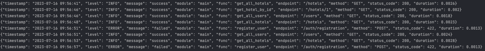

# Booking service

[](https://codecov.io/gh/ruauka/booking-service-py)
[](https://github.com/ruauka/booking-service-py/actions/workflows/pipeline.yml)

## Overview

Booking hotels pet-project service.

## Content

- [Description](#description)
- [Start](#start)
- [Usage](#usage)
- [CI](#ci)
- [Architecture](#architecture)
    - [Router](#router)
    - [Database](#database)
    - [Entities](#entities)
    - [Auth](#auth)
    - [Cache](#cache)
    - [Background-tasks](#background-tasks)
        - [Celery](#celery)
        - [Flower](#flower)
    - [Logging](#logging)
    - [Testing](#testing)
    - [Admin-panel](#admin-panel)
    - [Monitoring](#monitoring)

### Description

Service allows:

- book a hotel room
- notify the customer about the booking by Email
- manage booking orders and other entities using Admin Panel

### Start

To start service run in terminal:

```bash
docker-compose up -d
```

Service swagger is available at link - http://localhost/docs
To fill the database with test data:

- create new user with admin role
- login new user
- use uploader link http://localhost/docs#/Uploader/upload_from_sql_file_upload_sql_post
- upload file. The file with test data is in directory: `testdata/data.sql`

<p align="left">
    
</p>

Other links:

- Flower - http://localhost/flower/
- Admin panel - http://localhost/admin
- Grafana with pre-configured dashboard - http://localhost/grafana/d/_eX4mpl312/hotels-booking?orgId=1&refresh=5s

Stop service:

```bash
docker-compose stop
```

### Usage

- create new user with you **actual Email**
- login new user

Sample steps for booking a hotel room:

- check for available hotels and rooms by certain region - http://localhost/docs#/Hotels/get_hotels_by_location_hotels_location_get
- book a room by id (room_id you get on previous step) - http://localhost/docs#/Bookings/add_booking_bookings_post
- check your Email for booking confirmation

### CI

Service has DevOps pipeline using GitHub-Actions.

Stages:

- Testing: raising test PostgeSQL in docker in pipeline
- Linting: flake8

### Architecture

<p align="left">
    
</p>

### Router

Service based on the `Fastapi` framework and `Gunicorn` as WSGI server.
`Pydantic` validation.

Lib - https://fastapi.tiangolo.com/

### Database

`PostgreSQL` is used as database. All interactions with database are executed with ORM `SQLAlchemy`.
Migrations executes automatically when the service starts.

Lib - https://www.sqlalchemy.org/

### Entities

<p align="left">
    
</p>

### Auth

JWT Authorization.
User can have an administrator role, which gives the opportunity to edit entities.

Lib - https://pypi.org/project/python-jose/

### Cache

`Redis` is used for caching:

- Heavy requests: getting a list of hotels according to the specified parameters (for example by location)
- Background tasks

Lib - https://pypi.org/project/fastapi-cache2/

### Background tasks

### Celery

`Celery` is used to execute a background task: send an email notification to the customer after booking a room.

Lib - https://pypi.org/project/celery/

### Flower

`Flower` is used for administration of background tasks.
<p align="left">
    
</p>


Lib - https://pypi.org/project/flower/

### Logging

Logger can be configured by log-levels by env file:

- DEBUG
- INFO
- WARNING
- ERROR
- CRITICAL

Logs are output to the console.
<p align="left">
    
</p>


Lib - https://pypi.org/project/python-json-logger/

### Testing

Service is covered with unit and integration tests.
For local testing, it is necessary to raise test database (PostgeSQL) in docker with terminal command:

```bash
make pytest_db_up
```

Lib - https://pypi.org/project/pytest/

### Admin-panel

Admin-panel is used for database administration.
Only for a user with the `admin` role.
<p align="left">
    
</p>

Lib - https://aminalaee.dev/sqladmin

### Monitoring

Monitoring tools are `Prometheus` and `Grafana`.

To demonstrate the work of dashboards, in docker is running a script, which polls the service.

<p align="left">
    
</p>

Lib - https://pypi.org/project/prometheus-fastapi-instrumentator/